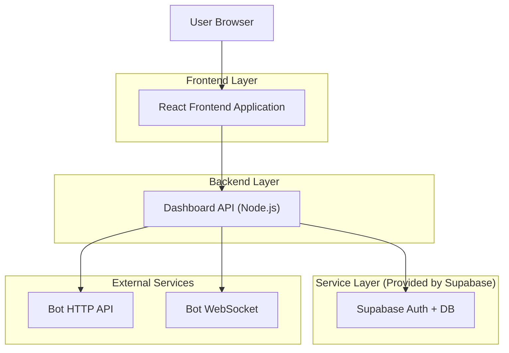
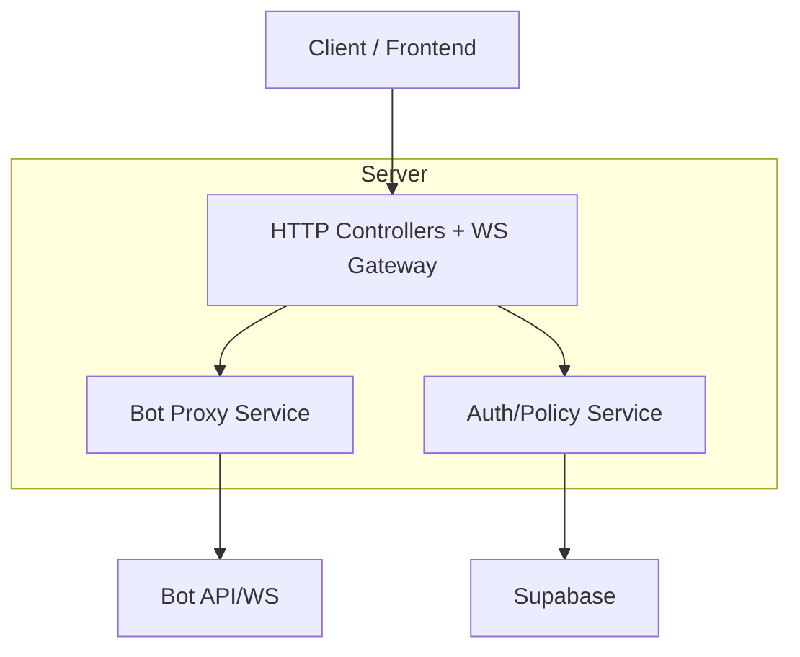
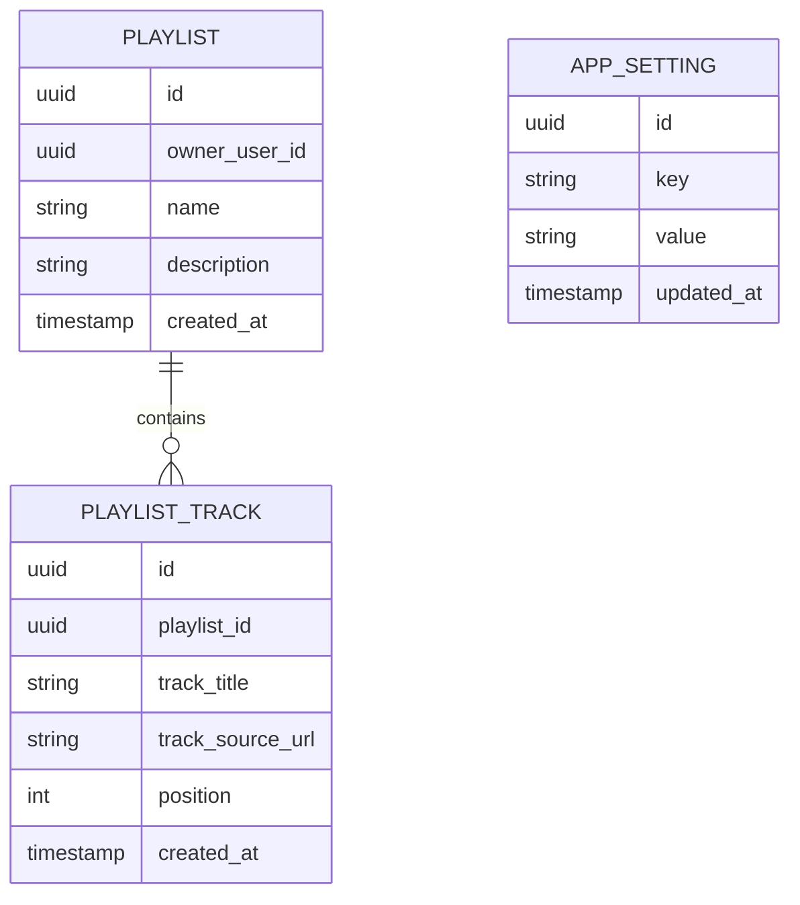

## 1.Architecture design


## 2.Technology Description
- Frontend: React@18 + vite + tailwindcss@3 + framer-motion + ws (cliente)
- Backend: Node.js + Express@4 + ws (servidor) + Supabase JS SDK
- Database/Auth: Supabase (PostgreSQL + Auth)

## 3.Route definitions
| Route | Purpose |
|-------|---------|
| /login | Autenticación y recuperación de sesión |
| /dashboard | Reproducción en vivo, cola y estado en tiempo real |
| /library | Biblioteca y gestión de playlists |
| /settings | Conexión al bot, usuarios/roles, preferencias |

## 4.API definitions (If it includes backend services)
### 4.1 Core API
**Estado y control de reproducción**
- GET /api/bot/state
- POST /api/bot/play
- POST /api/bot/pause
- POST /api/bot/skip
- POST /api/bot/volume
- POST /api/bot/queue/add
- POST /api/bot/queue/remove
- POST /api/bot/queue/reorder

**WebSocket (tiempo real)**
- WS /ws
  - server->client: state_update, queue_update, connection_status, error
  - client->server: subscribe, ping

**Tipos compartidos (TypeScript)**
```ts
type BotConnectionStatus = "connected" | "disconnected" | "reconnecting";

type Track = {
  id: string;
  title: string;
  artist?: string;
  durationMs?: number;
  artworkUrl?: string;
  sourceUrl?: string;
};

type PlaybackState = {
  status: BotConnectionStatus;
  isPlaying: boolean;
  positionMs: number;
  volume: number;
  nowPlaying?: Track;
};

type QueueItem = { id: string; track: Track; requestedBy?: string };
```

## 5.Server architecture diagram (If it includes backend services)


## 6.Data model(if applicable)
### 6.1 Data model definition


### 6.2 Data Definition Language
Playlists (playlist)
```
CREATE TABLE playlist (
  id UUID PRIMARY KEY DEFAULT gen_random_uuid(),
  owner_user_id UUID NOT NULL,
  name TEXT NOT NULL,
  description TEXT,
  created_at TIMESTAMPTZ DEFAULT NOW()
);

CREATE TABLE playlist_track (
  id UUID PRIMARY KEY DEFAULT gen_random_uuid(),
  playlist_id UUID NOT NULL,
  track_title TEXT NOT NULL,
  track_source_url TEXT,
  position INT DEFAULT 0,
  created_at TIMESTAMPTZ DEFAULT NOW()
);

CREATE TABLE app_setting (
  id UUID PRIMARY KEY DEFAULT gen_random_uuid(),
  key TEXT UNIQUE NOT NULL,
  value TEXT NOT NULL,
  updated_at TIMESTAMPTZ DEFAULT NOW()
);

GRANT SELECT ON playlist, playlist_track, app_setting TO anon;
GRANT ALL PRIVILEGES ON playlist, playlist_track, app_setting TO authenticated;
```
