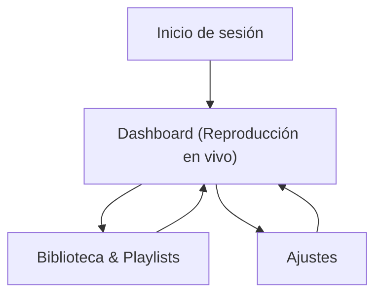

## 1. Product Overview
Dashboard web (desktop-first) para administrar la música de tu bot en tiempo real vía API/WS.
Permite controlar reproducción, gestionar biblioteca/playlists y configurar conexión/seguridad con una UI elegante (rosa/gris/azul/blanco) y animaciones suaves.

## 2. Core Features

### 2.1 User Roles
| Rol | Método de registro | Permisos principales |
|------|---------------------|----------------------|
| Admin | Email + invitación/correo aprobado | Control total del bot, gestión biblioteca/playlists, configuración |
| Operador (opcional) | Invitación por Admin | Control de reproducción y cola, sin cambiar configuración crítica |

### 2.2 Feature Module
La app se compone de las siguientes páginas principales:
1. **Inicio de sesión**: autenticación, recuperación de acceso.
2. **Dashboard (Reproducción en vivo)**: estado actual, controles, cola en tiempo real, acciones rápidas.
3. **Biblioteca & Playlists**: explorar/editar música, CRUD playlists, búsqueda.
4. **Ajustes**: conexión con el bot (API/WS), permisos/roles, preferencias UI.

### 2.3 Page Details
| Page Name | Module Name | Feature description |
|-----------|-------------|---------------------|
| Inicio de sesión | Autenticación | Iniciar sesión con email; cerrar sesión; manejar estados de error y carga. |
| Dashboard (Reproducción en vivo) | Estado del bot | Mostrar conectado/desconectado; latencia; canal/servidor activo (si aplica). |
| Dashboard (Reproducción en vivo) | Reproductor | Controlar play/pausa/stop; siguiente/anterior; volumen; seek (si el bot lo soporta). |
| Dashboard (Reproducción en vivo) | Ahora sonando | Mostrar título, artista, duración, progreso; carátula si existe. |
| Dashboard (Reproducción en vivo) | Cola en tiempo real | Ver cola; reordenar; eliminar; añadir desde biblioteca; reflejar cambios por WS. |
| Dashboard (Reproducción en vivo) | Notificaciones | Mostrar toasts de éxito/error; avisos de reconexión WS. |
| Biblioteca & Playlists | Biblioteca | Listar pistas; buscar/filtrar; ver detalle rápido; añadir a cola. |
| Biblioteca & Playlists | Playlists | Crear/editar/eliminar; agregar/quitar pistas; enviar playlist a cola. |
| Ajustes | Conexión Bot | Configurar URL API y WS; probar conexión; ver últimos errores. |
| Ajustes | Acceso y roles | Invitar/gestionar usuarios; asignar rol; revocar acceso. |
| Ajustes | Preferencias UI | Alternar densidad/tema; guardar preferencias por usuario. |

## 3. Core Process
**Flujo Admin**
1) Inicias sesión.
2) En Dashboard verificas conexión y controlas reproducción/cola en vivo (WS).
3) En Biblioteca buscas pistas y las envías a la cola o gestionas playlists.
4) En Ajustes configuras endpoints del bot, pruebas conexión y administras accesos.

